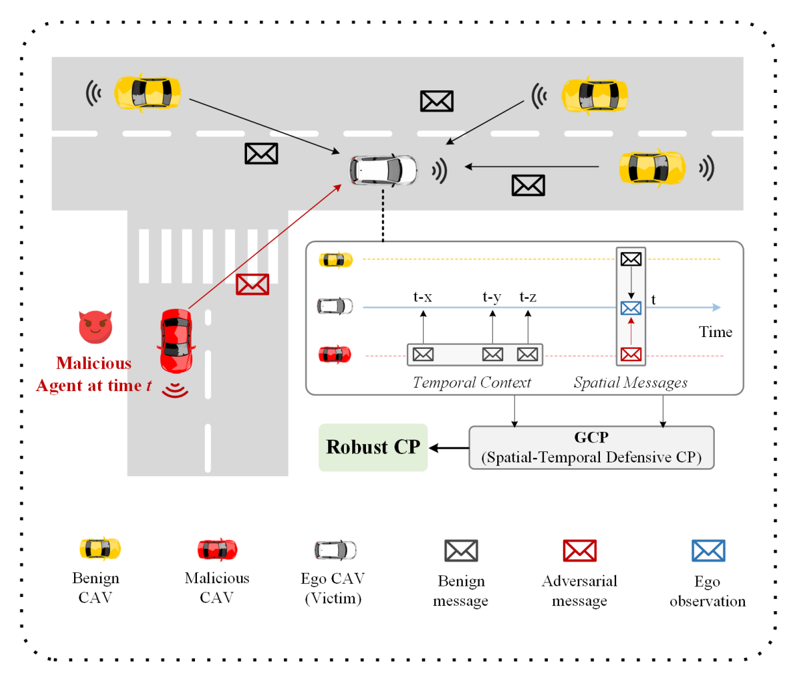

# GCP: Guarded Collaborative Perception with Spatial-Temporal Aware Malicious Agent Detection

[Yihang Tao*](https://scholar.google.com/citations?user=xxxxx), [Senkang Hu*](https://scholar.google.com/citations?user=xxxxx), Yue Hu, Haonan An, Hangcheng Cao, and [Yuguang Fang](https://scholar.google.com/citations?user=xxxxx), Fellow, IEEE

**"Spatial-Temporal Defense Framework for Robust Collaborative Perception Against Adversarial Attacks"**

<p align="center"> </p>

Accepted by **IEEE Transactions on Dependable and Secure Computing (TDSC)**.

[**IEEE TDSC PDF**](https://ieeexplore.ieee.org/document/11523166) | [**ArXiv Paper**](https://arxiv.org/abs/2501.02450)

## Abstract

Collaborative perception significantly enhances autonomous driving safety by extending each vehicle's perception range through message sharing among connected and autonomous vehicles. Unfortunately, it is also vulnerable to adversarial message attacks from malicious agents, resulting in severe performance degradation. While existing defenses employ hypothesis-and-verification frameworks to detect malicious agents based on single-shot outlier analysis, they overlook temporal message correlations, which can be circumvented by subtle yet harmful perturbations in model input and output spaces.
This paper reveals **GCP**, a novel **G**uarded **C**ollaborative **P**erception framework based on spatial-temporal aware malicious agent detection, which maintains single-shot spatial consistency through a confidence-scaled spatial concordance loss, while simultaneously examining temporal anomalies by reconstructing historical bird's eye view (BEV) motion flows in low-confidence regions. We also employ a joint spatial-temporal Benjamini-Hochberg test to synthesize dual-domain anomaly results for reliable malicious agent detection.

## Key Features

- **🎯 Blind Area Confusion (BAC) Attack**: Novel adversarial attack targeting less confident regions
- **🛡️ Spatial-Temporal Defense**: Combines spatial consistency and temporal BEV flow analysis
- **📊 Strong Performance**: 34.69% improvement in AP@0.5 over state-of-the-art defenses
- **⚡ Efficient**: Minimal computational overhead with real-time capability

## Installation

### Requirements

* Linux (tested on Ubuntu 18.04/20.04)
* Python 3.7+
* Anaconda
* PyTorch 1.12+
* CUDA 11.7

### Setup Environment

```bash
cd coperception
conda env create -f environment.yml
conda activate coperception

# Install PyTorch with CUDA
conda install pytorch torchvision torchaudio pytorch-cuda=11.7 -c pytorch -c nvidia

# Install CoPerception library
pip install -e .
```

### Dataset Preparation

Download the [V2X-Sim detection dataset](https://drive.google.com/file/d/1ZM_JkugZHmTwkR1gwG8ZuFq0YBwPDcDV/view?usp=drive_link) and extract it.

Dataset structure:
```
V2X-Sim-det/
├── train/
│   ├── agent_0/
│   ├── agent_1/
│   ...
└── test/
    ├── agent_0/
    ├── agent_1/
    ...
```

### BEVFlow Dataset for LSTM-AE

The LSTM-AE is trained on a scene-level `.npz` file that stores frame-wise BEV
boxes for one fixed scene and one fixed ego vehicle. The default example used in
this repository is:

- `coperception/logs/scene_0_ego_1.npz`

The raw export logic is implemented in
`coperception/coperception/datasets/BEVFlowGeneration.py`.

Conceptually, the BEVFlow dataset is constructed as follows:

1. Choose a target scene and ego vehicle.
2. Run the clean victim detector frame by frame on the V2X-Sim test split.
3. For each frame, collect the ego-view BEV bounding boxes produced in that scene.
4. Save the whole scene as one `.npz` file.

The exported `.npz` file contains:

- `bev_flows`: frame-wise BEV box arrays for the selected scene and ego vehicle
- `frame_ids`: frame indices stored in the same order as `bev_flows`
- `ego_id`: ego vehicle id used for export
- `scene_id`: source scene id

During LSTM-AE training, `train_lstm_ae.py` further converts this frame-level
data into object trajectories by:

1. Taking a sliding window of length `F` (`--seq_length`)
2. Matching boxes between consecutive frames with Hungarian matching under IoU
3. Keeping only consistently matched chains
4. Converting each matched object chain into one training sequence

So the `.npz` file is the frame-level export, and the actual LSTM-AE samples are
generated on the fly inside `train_lstm_ae.py`.

If you need to regenerate the default training file, save the exported result to:

- `coperception/logs/scene_<scene_id>_ego_<ego_agent>.npz`

For example, the default training input should be saved as:

- `coperception/logs/scene_0_ego_1.npz`

### Model Checkpoints

Download [pre-trained weights](https://drive.google.com/drive/folders/1dGEYIzc5ITFKR0TSZfXPYAIw2GBo4oBT?usp=share_link) and save them in `coperception/ckpt/`:

- `meanfusion/epoch_49.pth` - Clean victim model
- `meanfusion/epoch_advtrain_49.pth` - PGD-trained model (for adversarial training experiments)

For the default GCP runtime, also download the pre-trained LSTM-AE checkpoint from
[Google Drive](https://drive.google.com/file/d/1hm-StGJD2dmNLd1zbVrAsLaJoUop56Yx/view?usp=sharing).

- Corresponding temporal window length: `F = 5`
- Default runtime checkpoint path: `coperception/logs/model/best_model.pth`
- Save the downloaded file as: `coperception/logs/model/best_model.pth`

## Scope

This repository keeps the code needed for the core GCP runtime and training path:

- `coperception/tools/det/gcp.py`
- `coperception/coperception/utils/bac_attack.py`
- `coperception/coperception/models/det/LSTMAutoencoder.py`
- `coperception/tools/det/train_lstm_ae.py`
- `scripts/train_lstm_ae.sh`
- `scripts/run_gcp.sh`

Local analysis assets, temporary experiment scripts, rebuttal materials, figures,
logs, and offline BH-analysis files are treated as non-essential local files and
are excluded through `.gitignore`.

## Quick Start

### 1. Train LSTM-AE (Required for GCP Defense)

Expected input:

- A BEVFlow `.npz` file such as `coperception/logs/scene_0_ego_1.npz`
- Default temporal window length: `F = 5`

```bash
cd /path/to/GCP
./scripts/train_lstm_ae.sh \
    --data_path ./coperception/logs/scene_0_ego_1.npz \
    --save_path ./coperception/logs/model/ \
    --epochs 100 \
    --batch_size 32 \
    --seq_length 5
```

Direct Python entrypoint:
```bash
cd coperception/tools/det/
python train_lstm_ae.py \
    --data_path /path/to/bev_flow_data.npz \
    --save_path /path/to/model_dir \
    --epochs 100 \
    --batch_size 32 \
    --seq_length 5
```

### 2. Run GCP with PGD Attack by Default

```bash
cd /path/to/GCP
./scripts/run_gcp.sh
```

Default behavior:

- Defense mode: `gcp`
- Attack mode: `pgd`
- Number of attackers: `1`
- Scene: `8`
- LSTM-AE checkpoint: `coperception/logs/model/best_model.pth`
- LSTM-AE window length: `F = 5`

You can still override the mode or any attack/defense argument:

```bash
./scripts/run_gcp.sh gcp --scene_id 8 --sample_start 0 --sample_end 10
./scripts/run_gcp.sh no_defense --adv_method pgd --eps 0.5
./scripts/run_gcp.sh robosac --adv_method bac --step_budget 5
./scripts/run_gcp.sh gcp --adv_method bac
```

### Implementation Note

The current codebase follows the paper's BAC and GCP pipeline at the module level:

- BAC differential detection now explicitly partitions standalone detections and collaborative detections into matched, victim-only, and collaborative-only groups
- BAC still keeps cached masks, practical BRS hyper-parameters, and fallback masks for runtime stability
- GCP runtime keeps the spatial consistency plus temporal reconstruction path used in the paper
- LSTM-AE reconstruction is implemented as a practical sequence autoencoder shared by training and inference

## Running Experiments

The recommended entrypoints are the scripts under `scripts/`.

### Defense Methods

#### GCP Defense (Ours)
```bash
./scripts/run_gcp.sh
```

Equivalent explicit command:
```bash
./scripts/run_gcp.sh gcp --adv_method pgd
```

#### ROBOSAC Baseline
```bash
CUDA_VISIBLE_DEVICES=0 python gcp.py \
    --log \
    --gcp robosac_mAP \
    --adv_method pgd \
    --eps 0.5 \
    --adv_iter 15 \
    --number_of_attackers 1 \
    --step_budget 3
```

Or use: `./scripts/run_gcp.sh robosac`

#### MADE Baseline
```bash
CUDA_VISIBLE_DEVICES=0 python gcp.py \
    --log \
    --gcp made \
    --adv_method pgd \
    --eps 0.5 \
    --adv_iter 15 \
    --number_of_attackers 1
```

Or use: `./scripts/run_gcp.sh made`

#### Gated Late Fusion Baseline
```bash
CUDA_VISIBLE_DEVICES=0 python gcp.py \
    --log \
    --gcp gated_late_fusion \
    --adv_method pgd \
    --eps 0.5 \
    --adv_iter 15 \
    --number_of_attackers 2 \
    --gated_fusion_iou 0.3 \
    --gated_fusion_votes 2
```

Or use: `./scripts/run_gcp.sh gated_late_fusion`

**Note**: Gated Late Fusion is a simple baseline that implements consistency voting based on IoU matching across agents, without temporal checks or sophisticated anomaly detection. This baseline was requested by reviewers to quantify GCP's marginal benefit over simpler voting-based approaches.

**Parameters**:
- `--gated_fusion_iou`: IoU threshold for box matching (default: 0.3)
  - Lower values (0.1-0.3): Stricter matching
  - Higher values (0.5-0.7): More lenient matching
- `--gated_fusion_votes`: Minimum number of agents that must agree on a box (default: 2)
  - For 5 agents with 2 attackers, use `min_votes=3` for majority voting

#### No Defense (Attacked)
```bash
CUDA_VISIBLE_DEVICES=0 python gcp.py \
    --log \
    --gcp no_defense \
    --adv_method pgd \
    --eps 0.5 \
    --adv_iter 15 \
    --number_of_attackers 1
```

Or use: `./scripts/run_gcp.sh no_defense`

#### Upperbound (Clean Collaboration)
```bash
CUDA_VISIBLE_DEVICES=0 python gcp.py \
    --log \
    --gcp upperbound
```

Or use: `./scripts/run_gcp.sh upperbound`

#### Lowerbound (Ego-only)
```bash
CUDA_VISIBLE_DEVICES=0 python gcp.py \
    --log \
    --gcp lowerbound
```

Or use: `./scripts/run_gcp.sh lowerbound`

### Using the Automated Script with Custom Parameters

The `scripts/run_gcp.sh` script supports flexible parameter overriding:

```bash
# Basic usage with defaults (gcp + pgd)
./scripts/run_gcp.sh

# Override attack parameters
./scripts/run_gcp.sh no_defense --adv_method bac --eps 0.3 --num_attackers 2

# Override attack pattern
./scripts/run_gcp.sh gcp --attack_mode Poisson --attack_ratio 0.6

# Test specific frame range
./scripts/run_gcp.sh no_defense --scene_id 8 --sample_start 0 --sample_end 0
./scripts/run_gcp.sh gcp --scene_id 8 --sample_start 0 --sample_end 10
./scripts/run_gcp.sh no_defense --sample_start 50 --sample_end 60

# Combine multiple parameters
./scripts/run_gcp.sh robosac --adv_method bac --eps 0.5 --attack_mode SI --step_budget 5
```

**Sample Control:**
- `--scene_id N`: Test specific scene (default: 8). Scenes 8, 96, 97 have 6 agents.
- `--sample_start N`: Start frame ID (inclusive)
- `--sample_end N`: End frame ID (inclusive)
- **Frame range [start, end]**: Both boundaries are inclusive
- **No range specified**: Tests all frames in the scene (~100 frames)

### Attack Methods

Change the `--adv_method` parameter to test different attacks:

**PGD Attack**
```bash
--adv_method pgd --eps 0.5 --adv_iter 15
```

**BIM Attack**
```bash
--adv_method bim --eps 0.5 --adv_iter 15
```

**CW-L2 Attack**
```bash
--adv_method cw --eps 0.5 --adv_iter 15
```

**Simple BAC Attack** (Output-space weighting)
```bash
--adv_method simple_bac --simple_bac_eps 0.3 --eps 0.5 --adv_iter 15
```

**Full BAC Attack** (Input-space blind region targeting, ours)
```bash
--adv_method bac --eps 0.5 --adv_iter 15
```

### Attack Patterns

Change the `--attack_mode` parameter to test different temporal attack patterns:

**Random Attack (R-mode)**
```bash
--attack_mode Random --attack_ratio 0.6
```

**Poisson Attack (P-mode)**
```bash
--attack_mode Poisson --attack_ratio 0.6
```

**Susceptible-Infectious Attack (S-mode)**
```bash
--attack_mode SI --attack_ratio 0.6
```

### Example: Testing Different Combinations

**GCP vs BAC Attack with Random Pattern**
```bash
CUDA_VISIBLE_DEVICES=0 python gcp.py \
    --log \
    --gcp gcp \
    --adv_method bac \
    --eps 0.5 \
    --adv_iter 15 \
    --number_of_attackers 1 \
    --attack_mode Random \
    --attack_ratio 0.6 \
    --history_length 5
```

**ROBOSAC vs PGD Attack with Poisson Pattern**
```bash
CUDA_VISIBLE_DEVICES=0 python gcp.py \
    --log \
    --gcp robosac_mAP \
    --adv_method pgd \
    --eps 0.5 \
    --adv_iter 15 \
    --number_of_attackers 1 \
    --step_budget 3 \
    --attack_mode Poisson \
    --attack_ratio 0.6
```

**No Defense vs Simple BAC with SI Pattern**
```bash
CUDA_VISIBLE_DEVICES=0 python gcp.py \
    --log \
    --gcp no_defense \
    --adv_method simple_bac \
    --simple_bac_eps 0.3 \
    --eps 0.5 \
    --adv_iter 15 \
    --number_of_attackers 1 \
    --attack_mode SI \
    --attack_ratio 0.6
```

## Key Parameters

```bash
# Defense Modes
--gcp MODE                  # gcp/robosac_mAP/made/no_defense/upperbound/lowerbound

# Attack Methods
--adv_method METHOD         # pgd/bim/cw/simple_bac/bac (default in script: pgd)
--eps EPS                   # Attack epsilon (default: 0.5)
--adv_iter N                # Attack iterations (default: 15)
--number_of_attackers N     # Number of malicious agents (default: 1)
--bac_eps EPS               # BAC attack threshold (default: 0.3)
--simple_bac_eps EPS        # Simple BAC threshold (default: 0.3)

# Attack Patterns (Temporal)
--attack_mode MODE          # Random/Poisson/SI (default: Random)
--attack_ratio RATIO        # Proportion of adversarial frames 0.0-1.0 (default: 0.6)
                            # e.g., 0.6 means 60 out of 100 frames will be attacked

# GCP-specific Parameters
--history_length K          # Temporal sequence length (default: 5)
--reconstruction_threshold T # LSTM-AE anomaly threshold (default: 0.8)
--box_matching_thresh IoU   # Spatial matching threshold (default: 0.3)
--step_budget N             # ROBOSAC sampling budget (default: 3)

# Sample Control (determines number of test samples)
--scene_id SCENE            # Target scene ID (default: 8)
                            # Scenes 8, 96, 97 have 6 agents
--sample_start N            # Start frame ID, inclusive (default: None = from 0)
--sample_end N              # End frame ID, inclusive (default: None = to end)
--ego_agent ID              # Ego agent ID (default: 1)

# Other Options
--log                       # Enable logging to file
--visualization             # Enable result visualization (slower)
```

**Sample Control Examples:**
```bash
# Test all ~100 frames in scene 8
python gcp.py --gcp no_defense --scene_id 8

# Test only frame 0 (quick test)
python gcp.py --gcp no_defense --scene_id 8 --sample_start 0 --sample_end 0

# Test frames 0-10 (11 frames)
python gcp.py --gcp gcp --scene_id 8 --sample_start 0 --sample_end 10

# Test frames 50-99
python gcp.py --gcp robosac_mAP --sample_start 50 --sample_end 99

# Test from frame 20 to end
python gcp.py --gcp made --sample_start 20
```

## Project Structure

```
GCP/
├── coperception/
│   ├── coperception/
│   │   ├── models/det/
│   │   │   ├── LSTMAutoencoder.py      # ✅ LSTM-AE for temporal analysis
│   │   │   │                           #    - Shared runtime/training model
│   │   │   │                           #    - BEV flow reconstruction
│   │   │   ├── FaFNet.py                # Base collaborative perception model
│   │   │   └── ...
│   │   ├── datasets/
│   │   │   ├── V2XSimDet.py             # V2X-Sim dataset loader
│   │   │   └── BEVFlowGeneration.py     # ✅ BEV flow generator
│   │   └── utils/
│   │       ├── CoDetModule.py           # Detection module with attack integration
│   │       ├── bac_attack.py            # ⭐ BAC attack core implementation
│   │       │                            #    - Differential detection
│   │       │                            #    - Blind Region Segmentation (BRS)
│   │       │                            #    - Dual-weight optimization
│   │       │                            #    - Slow update mask caching
│   │       │                            #    - Runtime fallbacks / heuristics
│   │       └── ...
│   ├── tools/det/
│   │   ├── gcp.py                       # ✅ Main script for all experiments
│   │   │                                #    - Spatial consistency check
│   │   │                                #    - Temporal reconstruction scoring
│   │   │                                #    - Chain matching + Kalman fallback
│   │   ├── train_lstm_ae.py             # LSTM-AE training script
│   │   ├── train_codet.py               # Model training script
│   │   └── box_matching.py              # Detection matching utilities
│   └── ckpt/                            # Model checkpoints
├── scripts/
│   ├── run_gcp.sh                       # ✅ Default runner (GCP defense + BAC attack)
│   └── train_lstm_ae.sh                 # ✅ LSTM-AE training runner
└── README.md
```

## Citation

If you find this project useful in your research, please cite:

```bibtex
@article{tao2025gcpguardedcollaborativeperception,
      title={GCP: Guarded Collaborative Perception with Spatial-Temporal Aware Malicious Agent Detection}, 
      author={Yihang Tao and Senkang Hu and Yue Hu and Haonan An and Hangcheng Cao and Yuguang Fang},
      year={2025},
      eprint={2501.02450},
      archivePrefix={arXiv},
      primaryClass={cs.CV},
      url={https://arxiv.org/abs/2501.02450}, 
}

@ARTICLE{11523166,
  author={Tao, Yihang and Hu, Senkang and Hu, Yue and An, Haonan and Cao, Hangcheng and Fang, Yuguang},
  journal={IEEE Transactions on Dependable and Secure Computing}, 
  title={GCP: Guarded Collaborative Perception with Spatial-Temporal Aware Malicious Agent Detection}, 
  year={2026},
  volume={},
  number={},
  pages={1-14},
  keywords={Signal detection;Modeling;Fluid flow;Educational institutions;Timing;Long short term memory;Conferences;Computers;Optimization;Vehicle-to-everything;Connected and autonomous vehicle (CAV);collaborative perception;malicious agents;spatial-temporal detection},
  doi={10.1109/TDSC.2026.3693684}}
```

## Acknowledgment

This project builds upon the [coperception](https://github.com/coperception/coperception) library and incorporates defenses from [ROBOSAC (Among Us)](https://github.com/coperception/ROBOSAC).

Adversarial attacks are implemented using [adversarial-attacks-pytorch](https://github.com/Harry24k/adversarial-attacks-pytorch).

## License

This project is licensed under the MIT License - see the [LICENSE](LICENSE) file for details.

## Contact

For questions and discussions, please open an issue or contact:
- Yihang Tao: [yihang.tommy@my.cityu.edu.hk]
- Senkang Hu: [senkang.forest@my.cityu.edu.hk]
